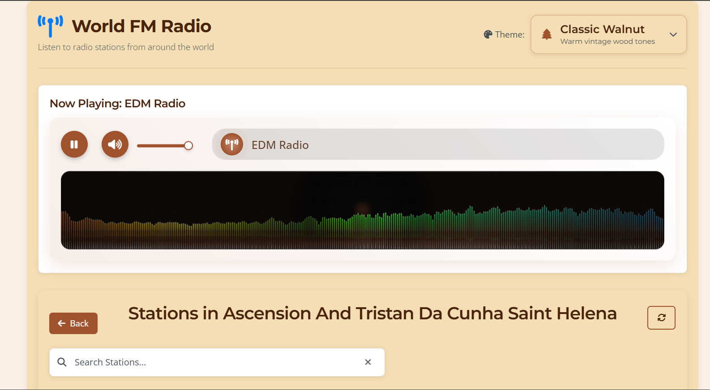
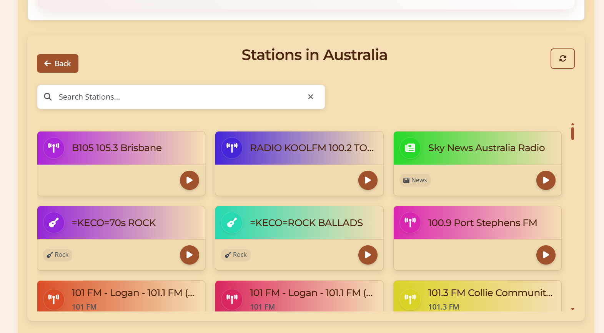
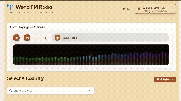

# 🌍 World FM Radio - Modern Web App

[](https://developer.mozilla.org/en-US/docs/Web/HTML)
[](https://developer.mozilla.org/en-US/docs/Web/CSS)
[](https://developer.mozilla.org/en-US/docs/Web/JavaScript)
[](https://jquery.com/)
[](https://getbootstrap.com/)
[](https://fontawesome.com/)

> 🎵 **Discover the world through radio** - A modern, feature-rich web application to stream radio stations from around the globe

## 📋 Table of Contents

- [✨ Features](#-features)
- [🚀 Demo](#-demo)
- [📸 Screenshots](#-screenshots)
- [🛠️ Technologies Used](#️-technologies-used)
- [⚡ Quick Start](#-quick-start)
- [📁 Project Structure](#-project-structure)
- [🎨 Themes](#-themes)
- [🔧 Configuration](#-configuration)
- [📱 Responsive Design](#-responsive-design)
- [🌐 API Integration](#-api-integration)
- [🎛️ Audio Features](#️-audio-features)
- [💾 Local Storage](#-local-storage)
- [🤝 Contributing](#-contributing)
- [📄 License](#-license)
- [🙏 Acknowledgments](#-acknowledgments)

## ✨ Features

### 🎵 **Core Radio Features**
- 🌍 **Global Radio Access** - Stream radio stations from 200+ countries
- 🎪 **Live Audio Streaming** - High-quality audio playback with Web Audio API
- 🔊 **Advanced Audio Controls** - Play/pause, volume control, mute functionality
- 📊 **Real-time Audio Visualization** - Dynamic frequency spectrum display
- 🎨 **Theme-aware Visualizations** - Audio bars adapt to selected theme colors

### 🗺️ **Country & Station Management**
- 🏳️ **Country Flags** - Visual country selection with flag displays
- 🔍 **Smart Search** - Search countries and stations with instant filtering
- 🌏 **Regional Filtering** - Browse by continent (Africa, Americas, Asia, Europe, Oceania)
- 📻 **Station Metadata** - Genre detection, language info, FM frequencies
- ⭐ **Favorites System** - Save and manage favorite radio stations
- 📜 **Recently Played** - Track your listening history

### 🎨 **Visual & UI Features**
- 🌈 **8 Beautiful Themes** - From classic to modern, light to dark modes
- 📱 **Fully Responsive** - Perfect on desktop, tablet, and mobile
- ✨ **Smooth Animations** - CSS transitions and micro-interactions
- 🎯 **Modern Design** - Clean, intuitive interface with FontAwesome icons
- 🔄 **Theme Persistence** - Your selected theme is remembered
- 🎪 **Loading Animations** - Elegant loading states and spinners

### 🔧 **Technical Features**
- 💾 **Local Storage** - Settings and favorites persist across sessions
- 🌐 **API Integration** - Real-time data from Radio Browser API
- 🎵 **Web Audio API** - Advanced audio processing and visualization
- 📱 **Progressive Enhancement** - Works on all modern browsers
- ⚡ **Performance Optimized** - Efficient rendering and memory management

## 🚀 Demo


**Live Demo:** [World FM Radio](https://your-demo-url.com) *(Replace with actual demo URL)*

## 📸 Screenshots

### 🏠 Home Page

- Modern player interface with audio visualization
- Country selection with beautiful flag displays
- Theme selector with live previews

### 📻 Station Browser

- Grid layout with station cards
- Genre icons and metadata display
- Play buttons and favorite controls

### 🎨 Theme Gallery
- 8 carefully crafted themes
- Real-time theme switching
- Color-coordinated audio visualizations

## 🎬 Live Video Demo



Experience the app in action with our interactive demo showing:
- Theme switching in real-time
- Audio visualization responding to music
- Smooth navigation between countries and stations
- Modern UI animations and transitions

## 🛠️ Technologies Used

### **Frontend Technologies**
| Technology | Version | Purpose |
|------------|---------|---------|
|  | HTML5 | Semantic markup and structure |
|  | CSS3 | Modern styling with custom properties |
|  | ES6+ | Dynamic functionality and interactions |
|  | 3.5.1 | DOM manipulation and AJAX requests |

### **UI & Styling**
| Library | Version | Purpose |
|---------|---------|---------|
|  | 4.5.2 | Responsive grid system |
|  | 6.4.0 | Beautiful icons throughout the app |
|  | - | Montserrat & Open Sans typography |

### **APIs & External Services**
- 🌐 **Radio Browser API** - Global radio station database
- 🏳️ **Flagpedia API** - Country flag images
- 🎵 **Web Audio API** - Audio processing and visualization

## ⚡ Quick Start

### **Prerequisites**
- 🌐 Modern web browser (Chrome, Firefox, Safari, Edge)
- 🌍 Internet connection for streaming
- 🔊 Audio output device (speakers/headphones)

### **Installation**

1. **📥 Clone the repository**
   ```bash
   git clone https://github.com/sourcecodeRTX/Rab_Da_Radio.git
   cd world-fm-radio
   ```

2. **🚀 Launch the application**
   
   **Option A: Direct File Opening**
   ```bash
   # Open index.html in your browser
   start index.html  # Windows
   open index.html   # macOS
   xdg-open index.html  # Linux
   ```

   **Option B: Local Server (Recommended)**
   ```bash
   # Python 3
   python -m http.server 8000
   
   # Python 2
   python -m SimpleHTTPServer 8000
   
   # Node.js (if you have http-server installed)
   npx http-server
   
   # PHP
   php -S localhost:8000
   ```

3. **🌍 Open in browser**
   - Navigate to `http://localhost:8000`
   - Or directly open `index.html` file

### **First Use**
1. 🎨 **Select a theme** from the theme selector in the header
2. 🌍 **Choose a country** from the country grid
3. 📻 **Pick a radio station** from the station list
4. 🎵 **Click play** and enjoy!

## 📁 Project Structure

```
📦 World FM Radio/
├── 📄 index.html              # Main HTML file
├── 📄 README.md               # This documentation
├── 🎨 style.css               # Main CSS styles and themes
├── 🎨 player-styles.css       # Audio player specific styles
├── 🎨 station-styles.css      # Station cards and lists styles
├── 📜 script.js               # Main JavaScript functionality
├── 📜 theme-preview.js        # Theme preview component
└── 📁 images/
    └── 🖼️ 1.png              # App logo and branding
```

### **File Breakdown**

| File | Size | Purpose |
|------|------|---------|
| `index.html` | ~5KB | 🏗️ App structure and layout |
| `style.css` | ~45KB | 🎨 Main styles, themes, and responsive design |
| `player-styles.css` | ~8KB | 🎵 Audio player and visualization styles |
| `script.js` | ~50KB | ⚡ Core functionality and interactions |
| `theme-preview.js` | ~4KB | 🎨 Theme switching component |

## 🎨 Themes

The app includes **8 beautiful themes**, each with its own personality:

### **🌊 Light Blue Classic** (Default)
- **Colors:** Ocean blues and whites
- **Mood:** Fresh, clean, modern
- **Best for:** General use, professional environments

### **🌳 Classic Walnut**
- **Colors:** Warm browns and creams
- **Mood:** Vintage, cozy, nostalgic
- **Best for:** Relaxed listening, vintage enthusiasts

### **🌿 Art Deco Green**
- **Colors:** Nature greens and whites
- **Mood:** Fresh, organic, calming
- **Best for:** Focus, productivity, nature lovers

### **☀️ Bakelite Ivory**
- **Colors:** Warm yellows and whites
- **Mood:** Bright, cheerful, retro
- **Best for:** Daytime listening, positive vibes

### **🏠 Mid-Century Teak**
- **Colors:** Muted browns and beiges
- **Mood:** Sophisticated, warm, timeless
- **Best for:** Evening listening, sophisticated taste

### **⚡ Retro Transistor Blue**
- **Colors:** Electric blues and cyans
- **Mood:** Energetic, modern, tech-inspired
- **Best for:** Electronic music, modern feel

### **🚀 Steampunk Brass**
- **Colors:** Industrial browns and brass
- **Mood:** Industrial, unique, vintage-futuristic
- **Best for:** Alternative music, unique aesthetics

### **❤️ Vintage Red**
- **Colors:** Classic reds and whites
- **Mood:** Bold, passionate, classic
- **Best for:** Jazz, classical, romantic music

### **🌙 Dark Mode**
- **Colors:** Dark grays and muted colors
- **Mood:** Easy on eyes, modern, sleek
- **Best for:** Night listening, eye strain reduction

## 🔧 Configuration

### **Theme Customization**
Themes are defined in `script.js` and can be easily customized:

```javascript
const themes = [
  {
    name: "Your Custom Theme",
    icon: "fas fa-star",
    description: "Your theme description",
    "--body-bg": "#your-color",
    "--container-bg": "#your-color",
    "--text-color": "#your-color",
    "--button-bg": "#your-color",
    // ... more CSS variables
  }
];
```

### **API Configuration**
The app uses Radio Browser API. No API key required:
- **Base URL:** `https://de1.api.radio-browser.info/json/`
- **Rate Limit:** Respectful usage, no explicit limits
- **CORS:** Enabled for web applications

### **Audio Settings**
Configurable in `script.js`:
```javascript
// Audio visualization settings
analyser.fftSize = 1024;           // Frequency resolution
const bufferLength = analyser.frequencyBinCount;

// Volume settings
const defaultVolume = 0.8;         // Default volume (80%)
const volumeStep = 0.05;           // Volume adjustment step
```

## 📱 Responsive Design

### **Breakpoints**
| Device | Width | Layout Changes |
|--------|-------|----------------|
| 📱 Mobile | < 768px | Single column, stacked elements |
| 📟 Tablet | 768px - 992px | Two columns, larger touch targets |
| 💻 Desktop | > 992px | Full grid layout, hover effects |

### **Responsive Features**
- ✅ **Fluid Typography** - Scales with screen size
- ✅ **Flexible Grids** - CSS Grid with auto-fit columns
- ✅ **Touch Optimization** - Larger buttons on mobile
- ✅ **Swipe Gestures** - Mobile-friendly interactions
- ✅ **Orientation Support** - Works in portrait and landscape

## 🌐 API Integration

### **Radio Browser API**
```javascript
// Country list endpoint
GET https://de1.api.radio-browser.info/json/countries

// Stations by country
GET https://de1.api.radio-browser.info/json/stations/bycountrycodeexact/{code}

// Search stations
GET https://de1.api.radio-browser.info/json/stations/search?name={query}
```

### **Response Handling**
- ✅ **Error Handling** - Graceful fallbacks for API failures
- ✅ **Loading States** - Visual feedback during data fetching
- ✅ **Caching** - Local storage for improved performance
- ✅ **Retry Logic** - Automatic retries for failed requests

## 🎛️ Audio Features

### **Audio Player**
- 🎵 **HTML5 Audio** - Native browser audio support
- 🔊 **Volume Control** - Smooth volume slider
- 🔇 **Mute Function** - One-click mute/unmute
- ⏯️ **Play/Pause** - Responsive playback controls

### **Audio Visualization**
- 📊 **Frequency Bars** - Real-time spectrum analysis
- 🎨 **Theme Integration** - Colors match selected theme
- ✨ **Smooth Animations** - 60fps visualizations
- 🌈 **Dynamic Effects** - Bass-responsive animations

### **Technical Specifications**
- **Sample Rate:** Matches source stream
- **Bit Depth:** 16-bit minimum
- **Channels:** Mono/Stereo support
- **Formats:** MP3, AAC, OGG, WebM

## 💾 Local Storage

The app stores various data locally for better user experience:

### **Stored Data**
```javascript
localStorage.setItem('selectedTheme', themeName);
localStorage.setItem('favoriteStations', JSON.stringify(favorites));
localStorage.setItem('recentlyPlayed', JSON.stringify(recent));
localStorage.setItem('playerVolume', volumeLevel);
localStorage.setItem('userPreferences', JSON.stringify(prefs));
```

### **Data Persistence**
- ✅ **Theme Selection** - Remembered across sessions
- ✅ **Favorite Stations** - Saved station list
- ✅ **Volume Level** - Audio preferences
- ✅ **Recent History** - Last played stations
- ✅ **Search History** - Quick access to searches

## 🤝 Contributing

We welcome contributions! Here's how you can help:

### **🐛 Bug Reports**
1. 📝 Use the issue template
2. 🔍 Include browser/OS info
3. 📋 Provide reproduction steps
4. 📷 Add screenshots if applicable

### **✨ Feature Requests**
1. 💡 Describe the feature clearly
2. 🎯 Explain the use case
3. 🔍 Check existing issues first
4. 🎨 Include mockups if helpful

### **💻 Code Contributions**
1. 🍴 Fork the repository
2. 🌿 Create a feature branch
3. ✅ Test thoroughly
4. 📝 Update documentation
5. 🔄 Submit a pull request

### **Development Setup**
```bash
# Clone your fork
git clone https://github.com/sourcecodeRTX/Rab_Da_Radio.git

# Create feature branch
git checkout -b feature/amazing-feature

# Make changes and test
# ... your development work ...

# Commit and push
git commit -m "Add amazing feature"
git push origin feature/amazing-feature
```

### **Code Style**
- ✅ **Consistent Formatting** - Use 4 spaces for indentation
- ✅ **Meaningful Names** - Clear variable and function names
- ✅ **Comments** - Document complex logic
- ✅ **Modern JavaScript** - ES6+ features preferred

## 📄 License

This project is licensed under the **MIT License** - see the [LICENSE](LICENSE) file for details.

### **MIT License Summary**
- ✅ **Commercial Use** - Use in commercial projects
- ✅ **Modification** - Modify and distribute
- ✅ **Distribution** - Share with others
- ✅ **Private Use** - Use privately
- ❌ **Liability** - No warranty provided
- ❌ **Trademark Use** - No trademark rights

## 🙏 Acknowledgments

### **APIs & Services**
- 🌐 **[Radio Browser](https://www.radio-browser.info/)** - Comprehensive radio station database
- 🏳️ **[Flagpedia](https://flagpedia.net/)** - Beautiful country flag images
- 🔤 **[Google Fonts](https://fonts.google.com/)** - Montserrat and Open Sans fonts

### **Libraries & Frameworks**
- ⚡ **[jQuery](https://jquery.com/)** - Simplified DOM manipulation
- 🎨 **[Bootstrap](https://getbootstrap.com/)** - Responsive CSS framework
- 🎯 **[Font Awesome](https://fontawesome.com/)** - Beautiful icon library

### **Inspiration**
- 📻 **Classic Radio Design** - Vintage radio aesthetics
- 🎵 **Music Streaming Apps** - Modern UI patterns
- 🌈 **Material Design** - Color and animation principles

---

## 🚀 Getting Started Now!

Ready to explore world radio? 

1. **📥 Download** or clone this repository
2. **🌐 Open** `index.html` in your browser
3. **🎨 Pick** your favorite theme
4. **🌍 Choose** a country
5. **📻 Select** a station
6. **🎵 Enjoy** radio from around the world!

---

**Made with ❤️ by [Your Name]**

*"Discover the world through radio"* 🌍📻✨
